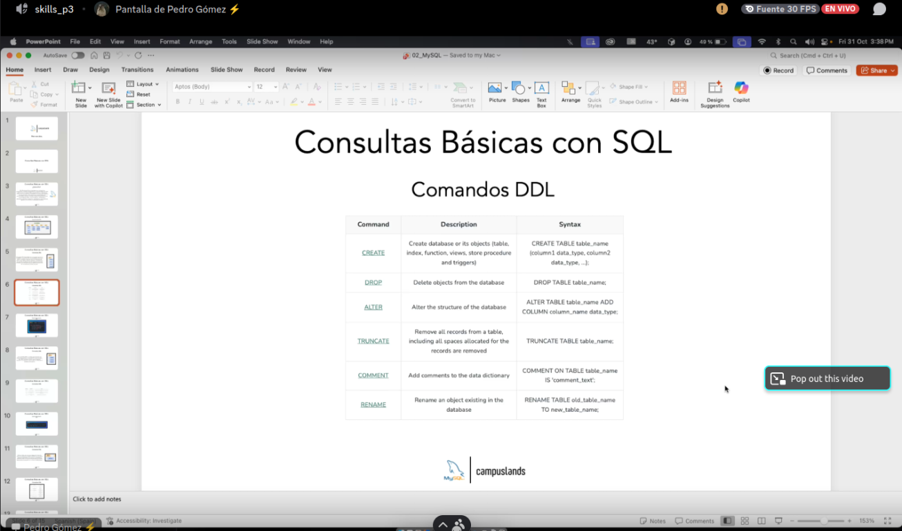

## Comandos



## Cómo Empezamos?

- Creamos la base de datos
- Creamos las tablas
- Insertamos datos
- Realizamos consultas
- Actualizamos datos
- Eliminamos datos
- Creamos relaciones entre tablas
- Aplicamos restricciones y claves foráneas
- Optimizamos el rendimiento de las consultas
- Realizamos copias de seguridad y recuperación de datos

## Debemos darle permisos al usuario

Los permisos del usuario se le dan desde sudo.

```bash
GRANT CREATE, ALTER, DROP, INSERT, UPDATE, INDEX, DELETE, SELECT, REFERENCES, RELOAD on *.* TO 'sammy'@'localhost' WITH GRANT OPTION;
```
## La Instrucción SELECT de MySQL

Esta instrucción SELECT se utiliza para seleccionar datos de una base de datos.

Los datos devueltos se almacenan en una tabla de resultados, denominada conjunto de resultados.

### Sintaxis de SELECT

```sql
SELECT column1, column2, ...
FROM table_name;
```

Aquí, `column1`, `column2`, ... son los nombres de los campos de la tabla de la que desea seleccionar datos. Si desea seleccionar todos los campos disponibles en la tabla, utilice la siguiente sintaxis:

```sql
SELECT * FROM table_name;
```

### Base de Datos de Demostración

En este tutorial utilizaremos la conocida base de datos de muestra Northwind.

A continuación se muestra una selección de la tabla "Clientes" de la base de datos de ejemplo Northwind:

| CustomerID | CustomerName                  | ContactName      | Address                  | City       | PostalCode | Country  |
|------------|-------------------------------|------------------|--------------------------|------------|------------|----------|
| 1          | Alfreds Futterkiste           | Maria Anders     | Obere Str. 57            | Berlin     | 12209      | Germany  |
| 2          | Ana Trujillo Emparedados y helados | Ana Trujillo | Avda. de la Constitución 2222 | México D.F. | 05021     | Mexico   |
| 3          | Antonio Moreno Taquería       | Antonio Moreno   | Mataderos 2312           | México D.F.| 05023     | Mexico   |
| 4          | Around the Horn               | Thomas Hardy     | 120 Hanover Sq.          | London     | WA1 1DP    | UK       |
| 5          | Berglunds snabbköp            | Christina Berglund | Berguvsvägen 8         | Luleå      | S-958 22   | Sweden   |

### Ejemplo de Columnas SELECT

La siguiente instrucción SQL selecciona las columnas "CustomerName", "City" y "Country" de la tabla "Customers":

```sql
SELECT CustomerName, City, Country FROM Customers;
```
## La Instrucción INSERT INTO de MySQL

Esta instrucción INSERT INTO se utiliza para insertar nuevos registros en una tabla.

### Sintaxis de INSERT INTO

La afirmación se puede redactar INSERT INTO de dos maneras:

1. Especifique tanto los nombres de las columnas como los valores que se insertarán:

```sql
INSERT INTO table_name (column1, column2, column3, ...)
VALUES (value1, value2, value3, ...);
```

2. Si agrega valores para todas las columnas de la tabla, no es necesario especificar los nombres de las columnas en la consulta SQL. Sin embargo, asegúrese de que el orden de los valores coincida con el orden de las columnas en la tabla. En este caso, la sintaxis INSERT INTO sería la siguiente:

```sql
INSERT INTO table_name
VALUES (value1, value2, value3, ...);
```

### Base de Datos de Demostración

A continuación se muestra una selección de la tabla "Clientes" de la base de datos de ejemplo Northwind:

| CustomerID | CustomerName          | ContactName     | Address                      | City     | PostalCode | Country  |
|------------|-----------------------|-----------------|------------------------------|----------|------------|----------|
| 89         | White Clover Markets  | Karl Jablonski  | 305 - 14th Ave. S. Suite 3B  | Seattle  | 98128      | USA      |
| 90         | Wilman Kala           | Matti Karttunen | Keskuskatu 45                | Helsinki | 21240      | Finland  |
| 91         | Wolski                | Zbyszek         | ul. Filtrowa 68              | Walla    | 01-012     | Poland   |

### Insertar en Ejemplo

La siguiente instrucción SQL inserta un nuevo registro en la tabla "Clientes":

```sql
INSERT INTO Customers (CustomerName, ContactName, Address, City, PostalCode, Country)
VALUES ('Cardinal', 'Tom B. Erichsen', 'Skagen 21', 'Stavanger', '4006', 'Norway');
```

La selección de la tabla "Clientes" ahora tendrá este aspecto:

| CustomerID | CustomerName          | ContactName     | Address                      | City      | PostalCode | Country  |
|------------|-----------------------|-----------------|------------------------------|-----------|------------|----------|
| 89         | White Clover Markets  | Karl Jablonski  | 305 - 14th Ave. S. Suite 3B  | Seattle   | 98128      | USA      |
| 90         | Wilman Kala           | Matti Karttunen | Keskuskatu 45                | Helsinki  | 21240      | Finland  |
| 91         | Wolski                | Zbyszek         | ul. Filtrowa 68              | Walla     | 01-012     | Poland   |
| 92         | Cardinal              | Tom B. Erichsen | Skagen 21                    | Stavanger | 4006       | Norway   |
