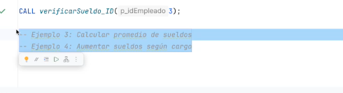

# Hacer los siguientes procedimientos



## Procedimiento 3

```sql
CREATE PROCEDURE promedioSueldos()
BEGIN 
	select AVG(sueldo) AS promedioSueldos
	FROM empleados;
END //

DELIMITER ;

CALL  promedioSueldos();
```

## Procedimiento 4

```sql
DELIMITER //
CREATE PROCEDURE aumentarSueldo()
BEGIN 
	UPDATE empleados
    SET sueldo =
        CASE
            WHEN cargo = 'Analista' THEN sueldo * 1.10
            WHEN cargo = 'Desarrolladora' THEN sueldo * 1.15
            WHEN cargo = 'Gerente' THEN sueldo * 1.05
            ELSE sueldo
        END;
END //

DELIMITER ;

CALL aumentarSueldo();
```